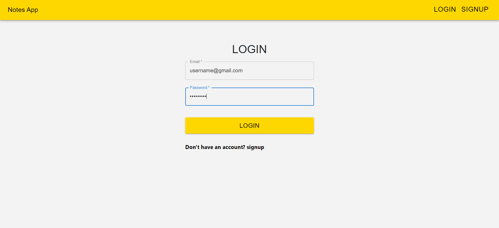

# 
 MERN Notes App

A web application for taking short notes.

## Tech Stack

**Client:** React JS

**Database:** MongoDB with Mongoose

## Features

- Authentication
- Create, Edit and Delete Notes

## Screenshots

## 
 Signup 

## 
 Login 

## 
 Create Note 

## 
 Edit Note 

## 
 Delete Note 

